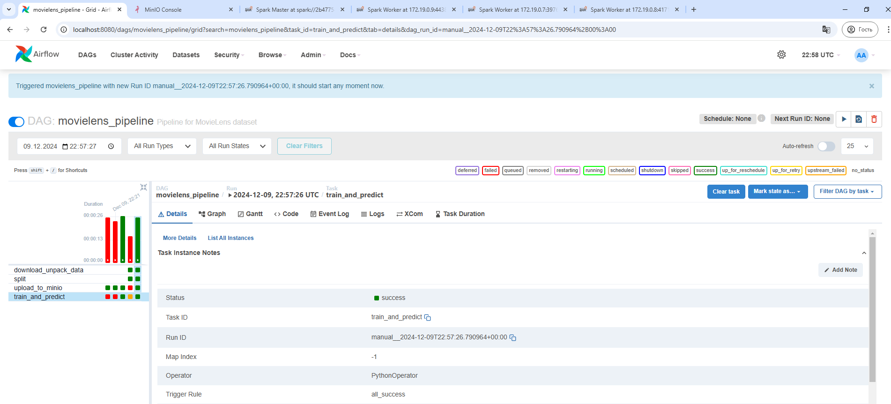
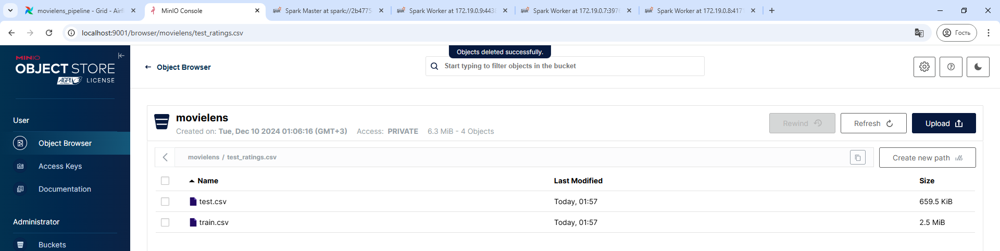
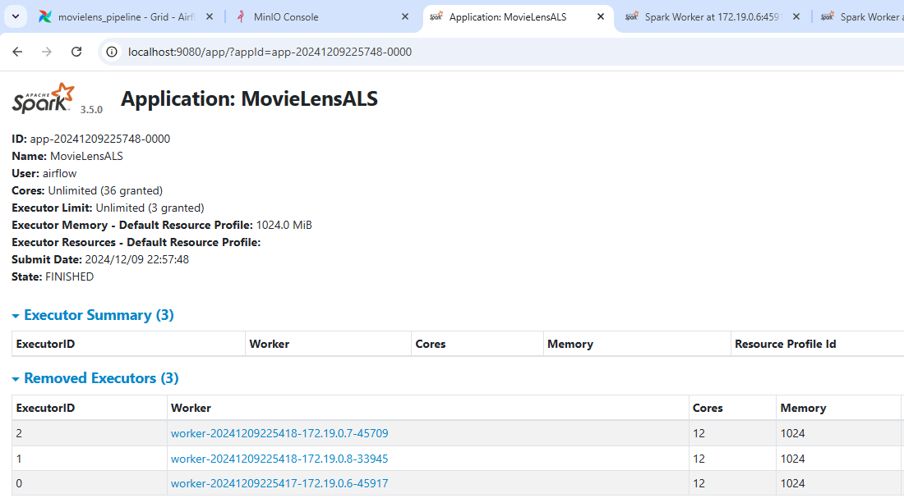

# MovieLens Pipeline with Apache Airflow, MinIO, and Apache Spark

**Note for the Professor:** To quickly verify the job and its execution, you can check the saved Docker logs directly in the repository. These logs provide detailed insights into the execution process and results. [Click here to view the logs](logs.txt).

This project demonstrates the orchestration of a data processing pipeline for the MovieLens dataset using **Apache Airflow**, **MinIO**, and **Apache Spark**.

## Overview

The pipeline consists of the following steps:
1. **Download and Unpack Data**: Fetches the MovieLens dataset and extracts it.
2. **Split Data**: Splits the dataset into training and testing sets.
3. **Upload to MinIO**: Uploads the split data to the MinIO bucket for storage.
4. **Train and Predict**: Trains a recommendation model using Apache Spark's ALS algorithm and generates predictions.

---

## Components and Configuration

### **Apache Airflow**
Apache Airflow is used to manage and orchestrate the entire pipeline. The DAG includes tasks for each step of the process.



---

### **MinIO**
MinIO is used as the object storage solution.



---

### **Apache Spark**
Apache Spark is used to process data and train the recommendation model using the ALS algorithm. The Spark cluster is deployed with one master and three worker nodes.



---

## Running the Project

### Prerequisites
1. Docker and Docker Compose installed.
2. The following tools installed locally:
   - `curl` for downloading the dataset.
   - Python 3.x.
3. Linux (Ubuntu was used for this project).

*If you are using Windows, use `wsl --install` in the command line. More information can be found at [WSL Installation Guide](https://learn.microsoft.com/en-us/windows/wsl/install).*

### Steps to Run

1. **Clone the repository**:
   ```bash
   git clone https://github.com/FuadBabaev/ML_SYSTEM_DESIGN.git
   cd ML_SYSTEM_DESIGN

2. **Build the Docker images**:
   Build the custom Docker images defined in the `Dockerfile`.
   ```bash
   docker-compose build
   ```

3. **Start the services**:
   Use `docker-compose` to start all the services in detached mode.
   ```bash
   docker-compose up -d
   ```

4. **Access the services**:
   - **Airflow**: [http://localhost:8080](http://localhost:8080)
     - Username: `airflow`
     - Password: `airflow`
   - **MinIO**: [http://localhost:9001](http://localhost:9001)
     - Username: `admin`
     - Password: `admin`
   - **Spark Master**: [http://localhost:9080](http://localhost:9080)
   - **Spark Worker**: Individual worker nodes are accessible via dynamically assigned ports.

5. **Trigger the pipeline**:
   - Navigate to the **Airflow Dashboard** and enable the `movielens_pipeline`.
   - Trigger the DAG.

6. **Monitor the pipeline**:
   - View task status and logs in the Airflow dashboard.
   - View predictions and intermediate outputs in MinIO under the `movielens` bucket.
```